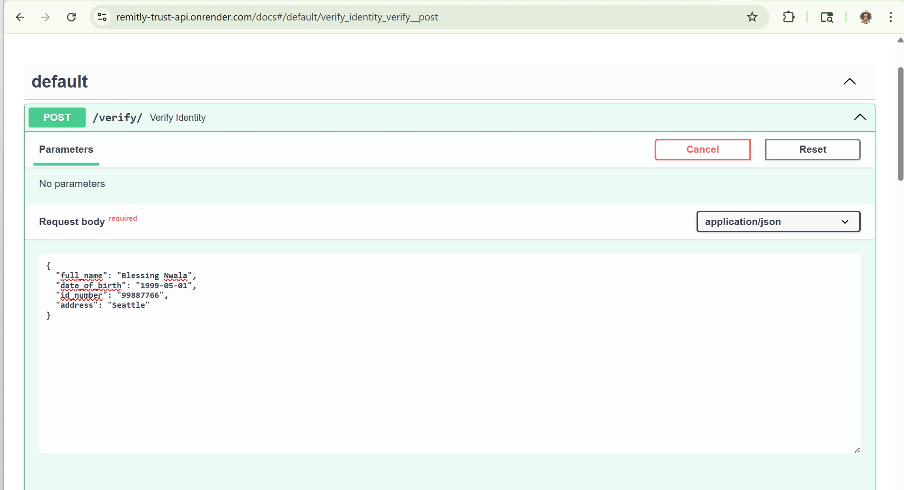
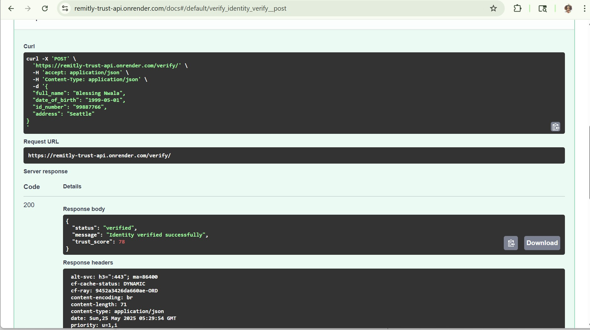
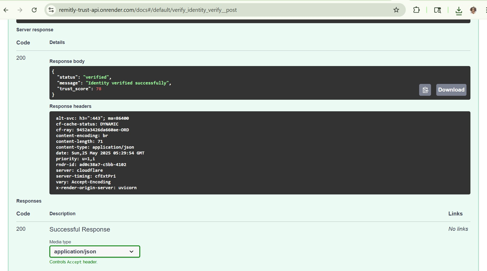
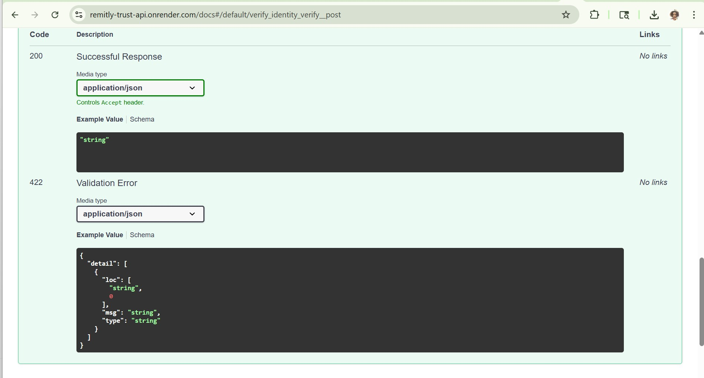
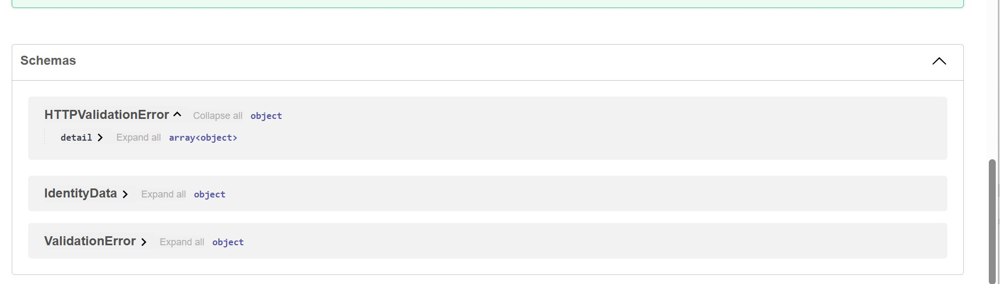

# Remitly Trust Platform API (Personal Project)

This project was inspired by my passion for building secure, reliable systems that support people across borders — just like Remitly’s mission. I created this backend API to simulate a core component of a Trust & Identity platform: verifying user identities, assigning trust scores, and flagging potential fraud — all in real-time.

As a backend-focused engineer, I wanted to demonstrate that I understand not just how to write APIs, but how to structure them with scalability, compliance, and security in mind. I also wanted to show that I can take initiative, break down a real-world system, and rebuild its core logic independently.

---

## 🌍 Live Demo

**🔗 [Click here to test the API live](https://remitly-trust-api.onrender.com/docs)**

You can submit your identity data in the Swagger UI and receive instant verification feedback with a trust score. If the trust score is too low, the system will flag it and log it to a database — mimicking real-world fraud prevention workflows.

---

## 🚀 Why I Built This

I’ve always been drawn to companies like Remitly that are solving global financial problems. I’m particularly interested in the backend systems that power trust: how identities are verified, how fraud is detected, and how infrastructure supports compliance at scale.

This API is my way of demonstrating:
- I understand **how to design secure backend workflows**
- I can write **clean, scalable Python code** using **FastAPI**
- I can work with **databases** to persist critical user flags
- I can deploy services using **modern DevOps tooling** like **Render**

---

## 📌 What It Does

- Accepts identity data: full name, date of birth, ID number, and address
- Checks for basic ID number validation (e.g., length, format)
- Randomly assigns a trust score (60–100) to simulate evaluation logic
- Flags low-trust identities (score < 70) for manual review
- Saves all flagged users in a local SQLite database using SQLAlchemy
- Provides a live Swagger UI for testing and documentation

---

## 🧪 Example Request

```json
{
  "full_name": "Blessing Nwala",
  "date_of_birth": "1999-05-01",
  "id_number": "99887766",
  "address": "Seattle"
}
````

## ✅ Example Response

```json
{
  "status": "verified",
  "message": "Identity verified successfully",
  "trust_score": 78
}
```

---

## 📸 Demo Screenshots

These screenshots show me testing the project live using my name.

| Input                                 | API Execution                      | Server Response                        |
| ------------------------------------- | ---------------------------------- | -------------------------------------- |
|    |   |  |
| **Response Headers**                  | **Swagger Docs**                   |                                        |
|  |  |                                        |

---

## 🛠 Technologies Used

* **Python 3.11**
* **FastAPI** – Web framework
* **Uvicorn** – ASGI server
* **SQLite** – Lightweight persistent storage
* **SQLAlchemy** – ORM for logging flagged identities
* **Render** – Cloud platform for public deployment
* **Swagger UI** – Auto-generated docs for easy testing

---

## 🔧 How to Run Locally

```bash
git clone https://github.com/nwalablessing/remitly-trust-api.git
cd remitly-trust-api
python -m venv env
source env/Scripts/activate  # Or use source env/bin/activate on Linux/Mac
pip install -r requirements.txt
uvicorn main:app --reload
```

Visit: `http://127.0.0.1:8000/docs` to test locally.

---

## 💡 What I Can Bring to a Team Like Remitly

I’m someone who learns quickly, builds thoughtfully, and deeply values trust, transparency, and real-world impact — the same values I see in Remitly’s products.

This project reflects what I bring to any engineering team:

* Ownership and initiative
* Backend development skills with real deployment experience
* A mindset for building tools that people trust

If you give me the opportunity, I’d love to contribute to systems that help people move money and build better lives across borders.

---


---

